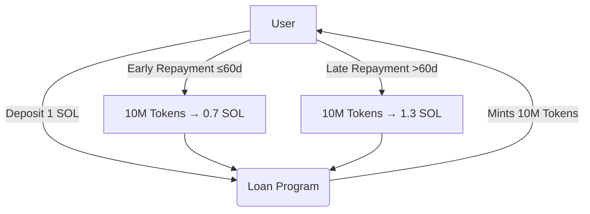

# 🚀 Solana Token Loan App (Token2022 Zero-Decimals Lending Protocol)
🌟 Overview
This DevNet-ready Solana lending platform allows users to borrow 10,000,000 project tokens against 1 SOL collateral. Built with Token2022 standard (0 decimals) for maximum gas efficiency.
solana loan app. 



## 🕒 Dynamic Repayment System

The protocol implements time-based incentives:

```rust
// Anchor program logic snippet
fn calculate_repayment(loan_age: u64) -> Result<u64> {
    const BASE_RATE: u64 = 1_000_000_000; // 1 SOL
    const EARLY_PENALTY: i64 = -300_000_000; // -0.3 SOL
    const LATE_BONUS: i64 = 300_000_000; // +0.3 SOL
    
    match loan_age.cmp(&SECONDS_PER_DAY * 60) {
        Ordering::Less => Ok((BASE_RATE as i64 + EARLY_BONUS) as u64),
        _ => Ok((BASE_RATE as i64 + LATE_PENALTY) as u64)
    }
}
```
