# 🚀 Solana Token Loan App (Token2022 Zero-Decimals Lending Protocol)


🌟 Overview
This DevNet-ready Solana lending platform allows users to borrow 10,000,000 project tokens against 1 SOL collateral. Built with Token2022 standard (0 decimals) for maximum gas efficiency.
solana loan app. 

```mermaid
graph TD
    A[User] -->|Deposit 1 SOL| B(Loan Program)
    B -->|Mints 10M Tokens| A
    A -->|Early Repayment ≤60d| C[10M Tokens → 0.7 SOL]
    A -->|Late Repayment >60d| D[10M Tokens → 1.3 SOL]
    C --> B
    D --> B
```




🔥 Key Features
Token2022 Implementation (0 decimals for simplified math)

Auto-Created ATAs (No wallet setup hassles)

Collateralized Loans (1 SOL = 10M tokens)

DevNet Battle-Tested (Active development phase)

🛠 Technical Stack
Anchor framework (Rust)

Token2022 Program

TypeScript client

DevNet deployment

## 🕒 Dynamic Repayment System

The protocol implements sophisticated time-based incentives:

```rust
// Anchor program logic for dynamic repayment calculation
// File: programs/loan/src/lib.rs

/// Calculates collateral return amount based on loan age
/// 
/// # Arguments
/// * `loan_age` - Duration in seconds since loan initiation
/// 
/// # Returns
/// u64 representing lamports amount to return
fn calculate_repayment(loan_age: u64) -> Result<u64> {
    const BASE_RATE: u64 = 1_000_000_000; // 1 SOL in lamports
    const EARLY_BONUS: i64 = -300_000_000; // -0.3 SOL incentive
    const LATE_PENALTY: i64 = 300_000_000; // +0.3 SOL penalty
    const GRACE_PERIOD: u64 = 60 * 86_400; // 60 days in seconds
    
    match loan_age.cmp(&GRACE_PERIOD) {
        Ordering::Less => Ok((BASE_RATE as i64 + EARLY_BONUS) as u64), // Early repayment bonus
        _ => Ok((BASE_RATE as i64 + LATE_PENALTY) as u64) // Late repayment penalty
    }
}
```

**Key Features:**
- 🕑 Time-sensitive repayment logic
- 💰 30% incentive/penalty structure
- ⚖️ Fair economic design
🚧 Current Development Status

+ Fully functional loan issuance
+ Automated ATA creation
- Repayment UI in progress
- Dynamic rates planned for v2

- 💡 Contribution Guidelines
Issues: Open for feature requests/bugs

PRs: Welcome for core improvements

Security: Report vulnerabilities privately

📜 License
MIT (Open-source with commercial-friendly terms)
