# 🚀 Solana Token Loan App (Token2022 Zero-Decimals Lending Protocol)

🌟 Overview
This DevNet-ready Solana lending platform allows users to borrow 10,000,000 project tokens against 1 SOL collateral. Built with Token2022 standard (0 decimals) for maximum gas efficiency.
solana loan app. 

```mermaid
graph TD
    A[User] -->|Deposit 1 SOL| B(Loan Program)
    B -->|Mints 10M Tokens| A
    A -->|Early Repayment ≤60d| C[10M Tokens → 0.7 SOL]
    A -->|Late Repayment >60d| D[10M Tokens → 1.3 SOL]
    C --> B
    D --> B
```

🔥 Key Features
Token2022 Implementation (0 decimals for simplified math)

Auto-Created ATAs (No wallet setup hassles)

Collateralized Loans (1 SOL = 10M tokens)

DevNet Battle-Tested (Active development phase)

🛠 Technical Stack
JavasScript Backend

Token2022 Program

TypeScript client

DevNet deployment

## 🕒 Dynamic Repayment System

The protocol implements sophisticated time-based incentives:
🏁 Quickstart
Clone the repo:

bash
Kopēt
Rediģēt
git clone https://github.com/tavs-repo/solana-token-loan.git
cd solana-token-loan
Install dependencies:

bash
Kopēt
Rediģēt
npm install
Start the frontend:

bash
Kopēt
Rediģēt
npm run dev
Connect your wallet to Solana DevNet and start testing.

⚠️ Known Issues & Limitations
Loan repayment UI is under development — may have bugs.

Dynamic interest rates and penalties planned but not yet live.

Backend APIs are evolving — breaking changes possible.

**Key Features:**
- 🕑 Time-sensitive repayment logic
- 💰 30% incentive/penalty structure
- ⚖️ Fair economic design
🚧 Current Development Status

+ Fully functional loan issuance
+ Automated ATA creation
- Repayment UI in progress
- Dynamic rates planned for v2

- 💡 Contribution Guidelines
Issues: Open for feature requests/bugs

PRs: Welcome for core improvements

Security: Report vulnerabilities privately

📜 License
MIT (Open-source with commercial-friendly terms)
